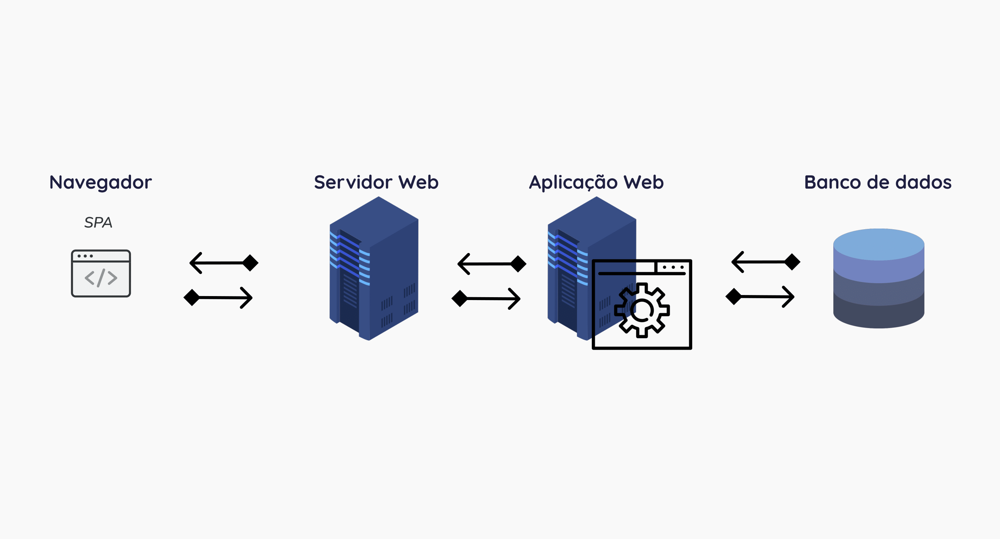
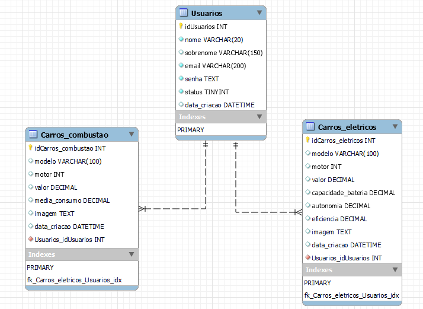

# Arquitetura da Solução

Definição de como o software é estruturado em termos dos componentes que fazem parte da solução e do ambiente de hospedagem da aplicação.

## Diagrama de Classes

O diagrama de classes ilustra graficamente como será a estrutura do software, e como cada uma das classes da sua estrutura estarão interligadas. Essas classes servem de modelo para materializar os objetos que executarão na memória.

## Modelo ER

O Modelo ER representa através de um diagrama como as entidades (coisas, objetos) se relacionam entre si na aplicação interativa.

## Esquema Relacional

O Esquema Relacional corresponde à representação dos dados em tabelas juntamente com as restrições de integridade e chave primária.
O esquema é composto por três tabelas. Uma tabela representando os usuários (administrativos) do sistema, com seus respectivos dados. E duas tabelas
para representar os carros elétricos e os carros a combustão. Os carros recebem como chave estrangeira a chave primária do usuário que o cadastrou, possibilitando
em sua seção, listar somente os carros cadastrados por ele.

## Modelo Físico (DDL)
O arquivo (ddl.sql) contendo os comandos para a criação das tabelas do banco de dados relacional do projeto encontra-se dentro da pasta src/bd. 

## Instruções SQL de Manipulação do BD (DML)

O arquivo (dml.sql) contendo os scripts de manipulação de banco de dados está incluído dentro da pasta src\bd.

## Tecnologias Utilizadas

Tecnologias utilizadas para geração de conteúdo no lado servidor.

 - **Framework ASP.NET Core MVC** 

Outras tecnologias 

IDE (Ambiente de desenvolvimento integrado) 

Usado para o desenvolvimento do código. 

- **Visual Studio 2022** 

Ferramentas 

Usadas para a criação dos diagramas presentes na documentação do projeto. 

- **Figma** 

- **Lucidchart** 

Figura explicando como as tecnologias estão relacionadas ou como uma interação do usuário com o sistema vai ser conduzida, por onde ela passa até retornar uma resposta ao usuário.

## Hospedagem

- **Heroku**

O Heroku utiliza o Git para realizar o deploy dos app.

Link do projeto
https://eletricharge-aspnet.herokuapp.com
